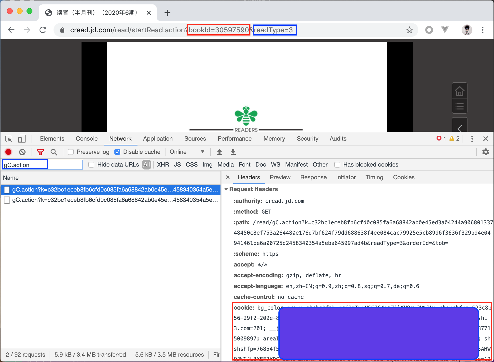
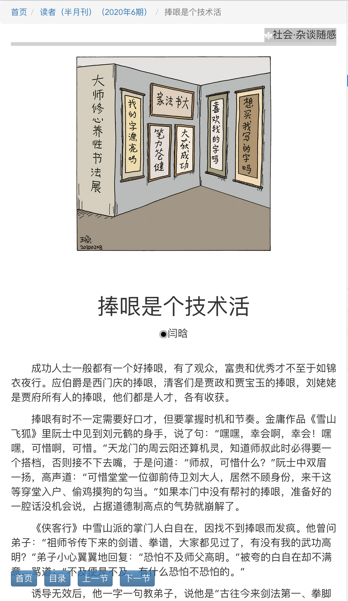
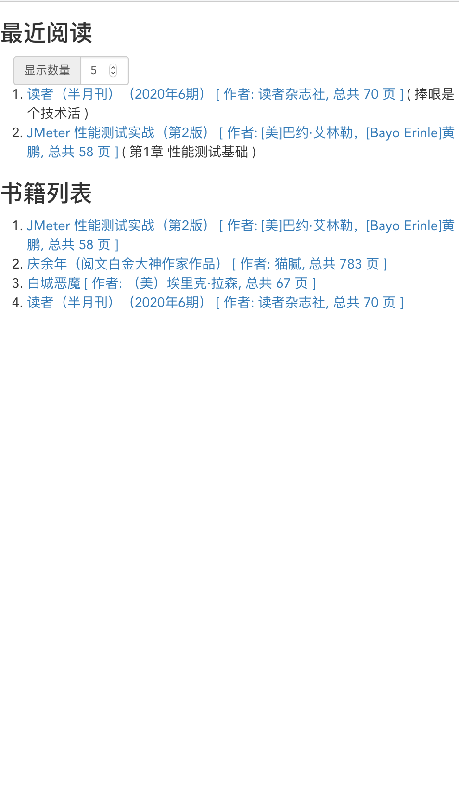

# 京东电子图书下载工具

此项目代码仅供个人学习参考, 严禁传播版权图书. 

## 下载方法

1. 将本项目clone到本地, 执行 `npm install` (国内环境可使用 `npm install --registry=https://registry.npm.taobao.org`).
2. 使用浏览器登录京东账号, 进入[我的已购电子书](https://cread.jd.com/buyedEbook/buyedEbook_myBuyedBookList.action)选择 _立即阅读_ ( 必须是有权限阅读的书 ), 打开浏览器开发者工具, 通过关键字`gC.action`过滤请求找到其中一个 `https://cread.jd.com/read/gC.action` 请求, 复制请求的 `cookie` 全部值(每个人的不一样), 以及请求参数的 `bookId` 值:
, 配置到项目根目录的 `package.json` 文件的 `config` 配置节.
3. 项目根目录打开终端/控制台执行 `npm run download`
4. `logs/` 目录下有下载进度日志, 下载内容会保存到 `books/` 目录.
5. 特别注意的是  `package.json > config > readType`, 如果是试读下载, 值改成1; 如果是畅读会员下载, 值改成3, 一般默认是3.

## 阅读

1. 执行 `npm run reader`, 然后使用浏览器访问 `http://localhost:8002/reader/` 即可. (阅读的前提是 `/books` 目录下有下载好的书籍), 效果如下: 

